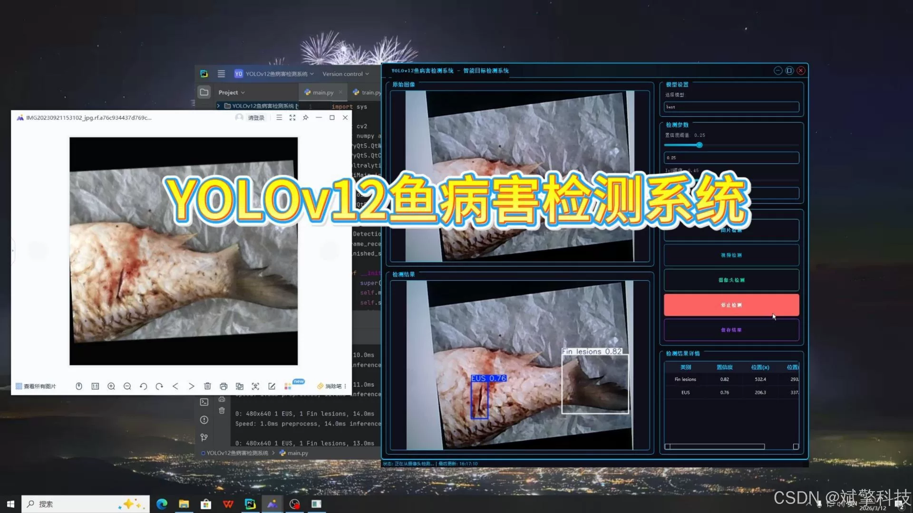
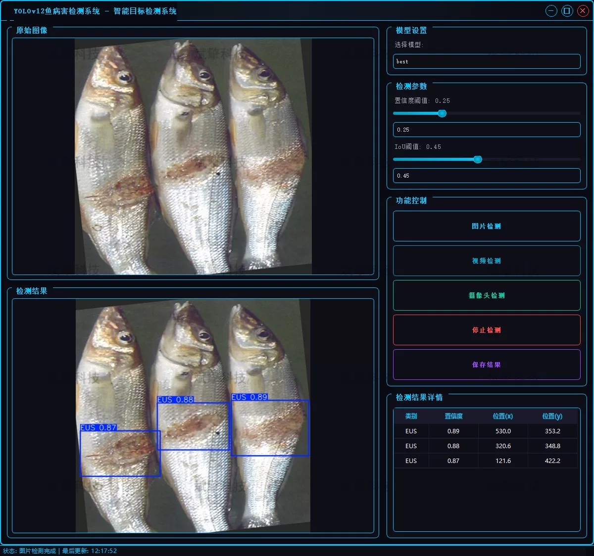
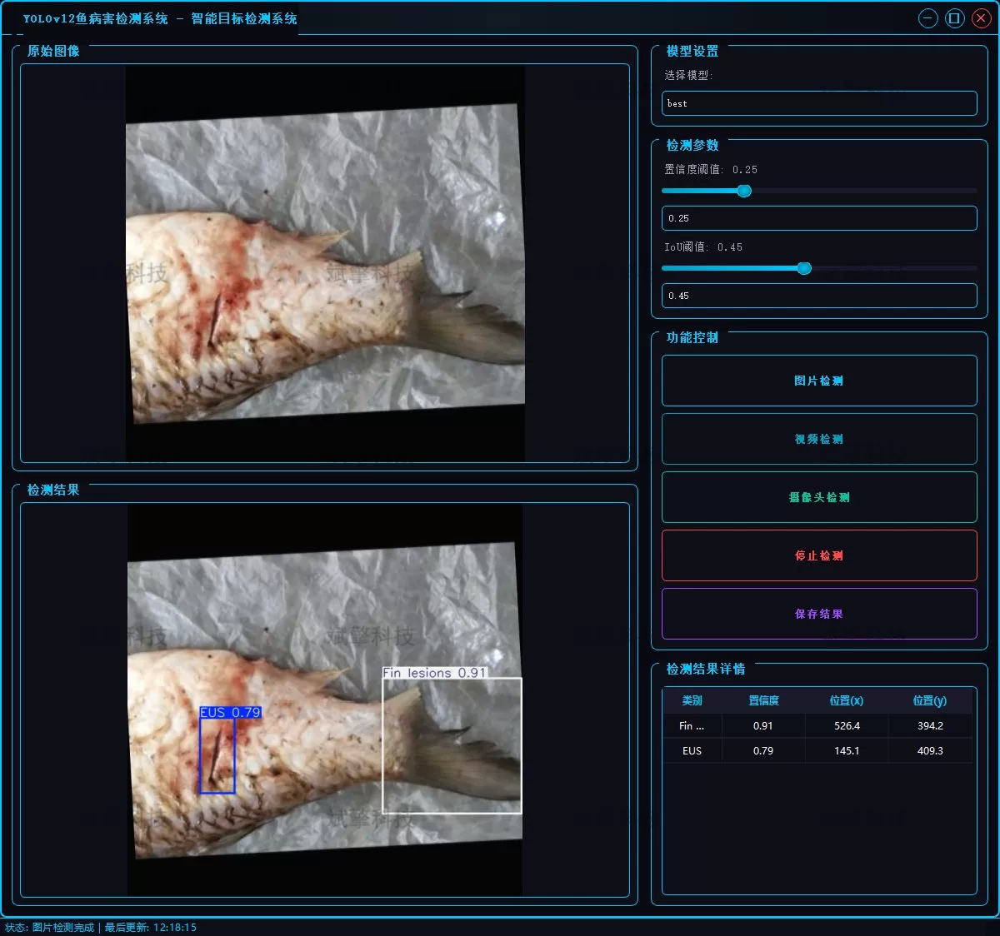
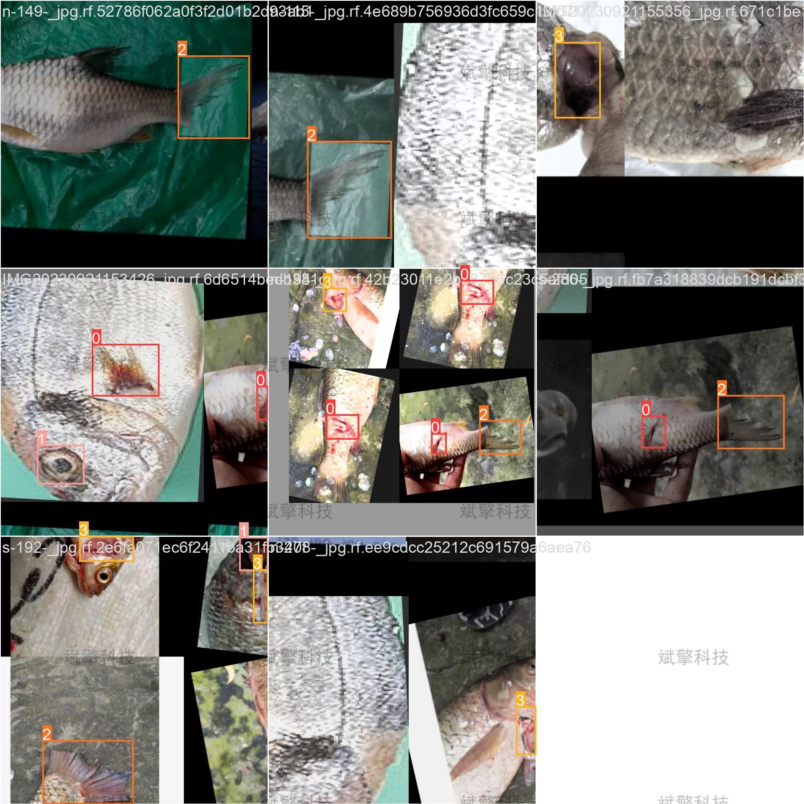
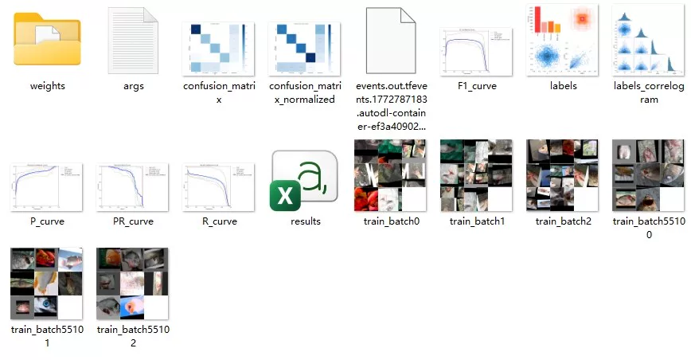
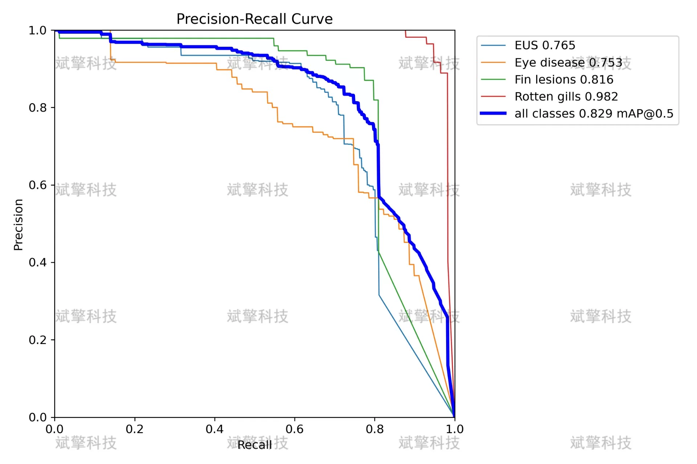

# YOLOv12 fish disease detection system

## Body

The YOLOv12 Fish Disease Detection System, based on the deep learning model YOLOv12, aims to develop a fish disease detection system that can automatically identify and detect common fish diseases in aquaculture. The system is designed to accurately recognize four common fish diseases: Ulcerative Stomatitis (EUS), eye diseases, fin lesions, and scabby diseases, providing a convenient and efficient tool for aquaculture practitioners.

By training and optimizing the YOLOv12 model, the system achieved good detection results on the test set. To meet the needs of different application scenarios, the system integrates three modes of image detection, video detection, and real-time camera detection. Experimental results show that the system can effectively assist farmers in monitoring fish diseases, possessing high practical value and prospects for promotion.

System Function Overview
✅ User Login and Registration: Supports password verification and security validation.
✅ Three Detection Modes: Based on the YOLOv12 model, supports image, video, and real-time camera detection, with precise target recognition.
✅ Dual-Screen Comparison: Displays the original image and detection result on the same screen.
✅ Data Visualization: Real-time table displaying the category, confidence, and coordinates of detected targets.
✅ Intelligent Parameter Tuning: Offers a confidence slide bar to dynamically optimize detection accuracy, adapting to different scene requirements.
✅ Sci-Fi Interactive Interface: Dark theme combined with dynamic light effects, reducing visual fatigue and improving operational experience.
✅ Multi-Thread High-Performance Architecture: Independent detection threads ensure smooth operation, real-time status prompts, and rapid response without lag.
Dataset Introduction
Training Set (Train): 2321 images used for model learning and parameter optimization.
Validation Set (Val): 255 images used for model tuning and hyperparameter selection during training.
Test Set (Test): 290 images used for final model performance evaluation.

## Images

## Payment

Here is a pay link on Stripe ( https://buy.stripe.com/3cs8yP7sY87d0vu9AB ). Please contact me lonlonago@foxmail.com after funding $89, and I will send you a complete data files , thank you!

